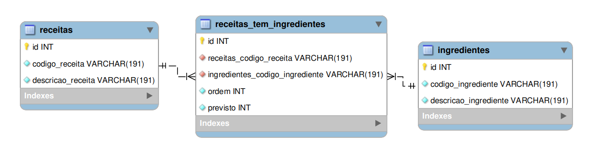

# Desafio-STW
Criar o frontend e o backend para criação e edição de listas de receitas

# Descritivo do desafio
## Backend
O desafio é implementar um backend REST para uma aplicação de criação e edição de receitas.

Com as seguintes funcionalidades:
1. Receitas
  - [ ] Listar receitas
  - [ ] Listar uma determinada receita com seus respectivos ingredientes
  - [ ] Adicionar uma nova receita com seus respectivos ingredientes
  - [ ] Atualizar uma receita com seus respectivos ingredientes
  - [ ] Excluir uma receita

2. Ingredientes
  - [x] Listar os ingredientes
  - [x] Adicionar um novo ingrediente
  - [x] Atualizar um ingrediente
  - [x] Excluir um ingrediente

Passso-a-passo
  - [x] Modelar o banco no MySQL Workbench
  - [x] Configurar o express com typescript
  - [x] Instalar o prisma e criar as migrations
  - [x] Cadastrar itens iniciais para teste
  - [x] Criar CRUD de ingredientes
  - [x] Configurar o cors
  -Frontend
  - [x] Criar aplicação basica react
  - [x] Instalar e configurar Tailwindcss

  - [x] Configurar rota /ingredients
  - [x] Criar tela de cadastro de ingredientes
  - [x] Configurar formulario de cadastro de ingredientes
  - [x] Ao abrir a página os ingredientes devem aparecer na tabela
  - [x] Adicionar função ao botão de adicionar ingrediente
  - [x] Adicionar função ao botão de excluir ingrediente
  - [ ] Adicionar função ao botão de editar ingrediente

  - [ ] Configurar rota /recipes
  - [ ] Configurar formulario de cadastro de receitas

  ## Modelagem do banco de dados

O banco de dados utilizado está ilustrado na figura abaixo:
  